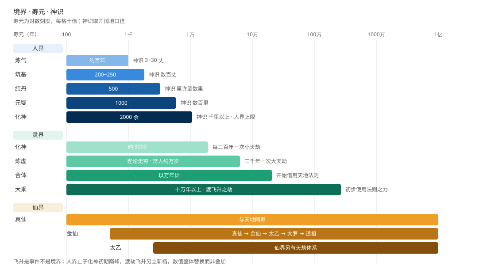
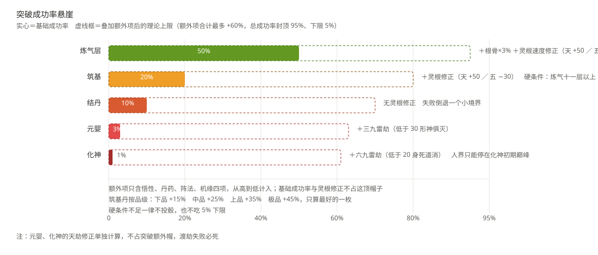
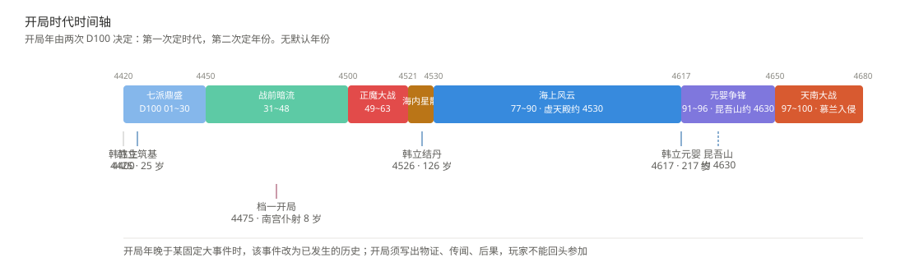
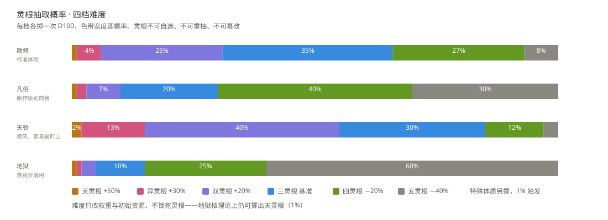
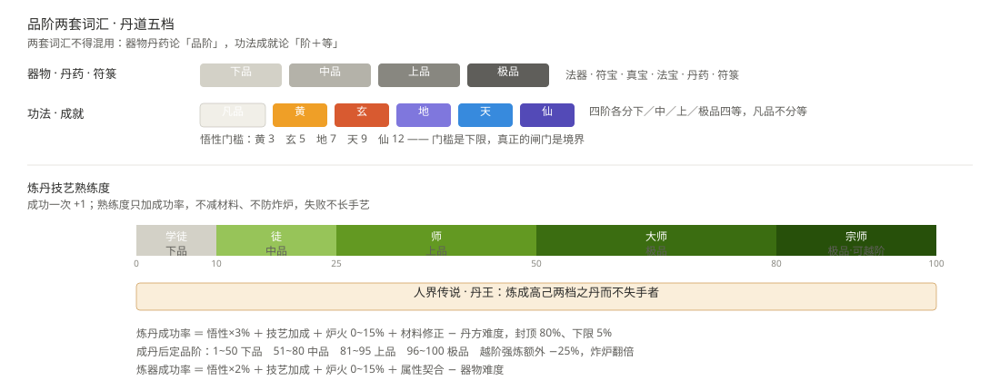
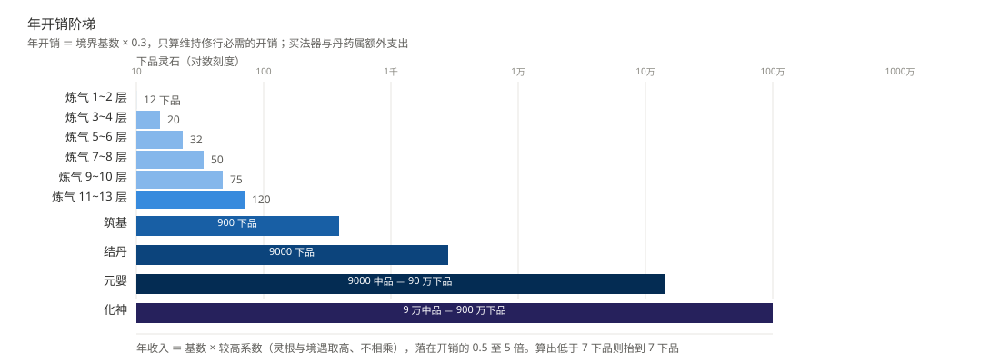
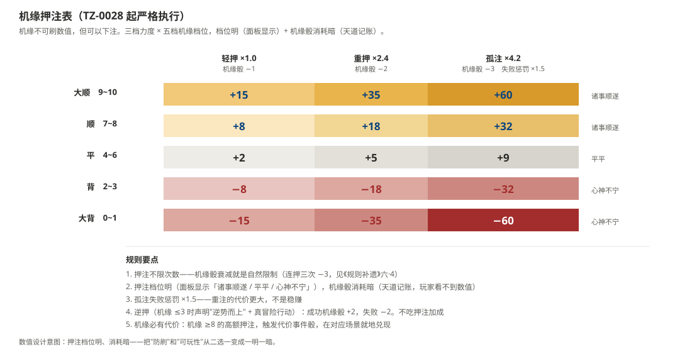
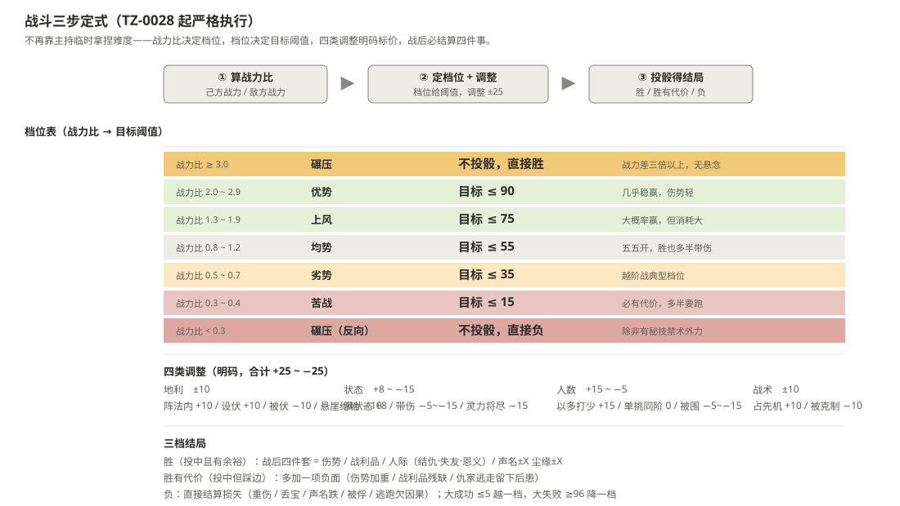
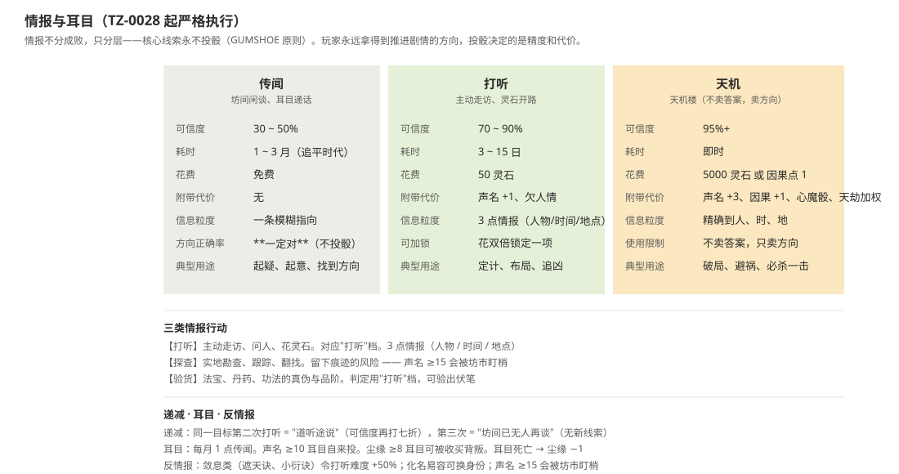

# 《凡人修仙传·人生模拟器》

> 一套由 AI 扮演【天道】主持的中文文字修仙人生模拟器规则集。
>
> An AI-run text life simulator set in the world of *A Record of a Mortal's Journey to Immortality*.

这不是可执行程序，而是一套**面向大语言模型的跑团式规则文档**。玩家只做决定，其余交给天意：出身、灵根、寿元、机缘、天劫，全在一颗 D100 骰子里。

## 项目简介

AI 在游戏中担任唯一主持人**【天道】**，同时负责两件事：

- **规则执法**：投骰、算数、更新面板，公示每一次判定，不暗改数值；
- **剧情演绎**：扮演修仙界的所有 NPC、妖兽与宗门，信息分层释放，不替玩家做决定。

玩家从一名凡人起步，在人界【天南】掷骰求生，一路走过炼气、筑基、结丹、元婴、化神，直至飞升灵界。基调是"凡人流"式的冷酷：资质、资源、机缘三者缺一，便可能困死一境，寿尽坐化。

## 核心特性

| 系统 | 说明 |
| --- | --- |
| 全程公示掷骰 | 所有判定用 D100，公示骰值与修正；公证编号（TZ-XXXX）可回溯、防暗改。**公证只落在命运转折点**（突破、重伤、死亡、大额收支、系统事件、天劫、卷末），普通判定进存档块，不占编号 |
| 开局三件套 | 出身 18 选一；灵根按权重掷骰（天/异/双/三/四/五灵根），不可自选、不可重抽；特殊体质黑箱触发 |
| 可选「系统」 | 17 项系统池中抽三个、三选一，终身不可更换；不要系统则自由点 +4，且首次机缘判定 +10% |
| 修仙全链路 | 五大境界（炼气十三层→筑基→结丹→元婴→化神）、突破判定、心魔幻境、三九/六九雷劫；功法、法术、丹药、炼器、符箓、阵法、灵兽灵虫 |
| 时间即成本 | 寿元倒计时、闭关跨年、NPC 老化换代、世界时钟（每 50 年推演一格）与固定历史事件 |
| **尘缘与声名** | 第六维**尘缘**（0~10＋「断」态）：高尘缘心魔判定 +10% 但有软肋，低尘缘易脱身却更孤独；**每次闭关 ≥1 年，出关必写凡俗亲友的现状**。**声名**（0~20）独立于声望：声望是别人怎么看你，声名是别人记不记得你 |
| **机缘可观测** | 机缘三档刻度（诸事顺遂 / 平平 / 心神不宁）＋ **押注**（三档力度 × 五档机缘）＋ **逆押**（机缘差时真冒险翻盘）＋ 衰减。**押注不限次数**，机缘骰衰减是自然限制 |
| **突破溢出品质制** | 无 95% 封顶、无 +60% 帽子。≥200% 必成·上品／150~199% 必成·中品／100~149% 必成·下品／<100% 才投骰。堆概率就能堆出好道基 |
| **战斗三步定式** | 战力比 → 档位表 → 四类调整（地利/状态/人数/战术，合计 ±25）→ 三档结局。**战后四件套**：打赢一场架 = 结仇 + 失友 + 夺宝 + 抬声名，四件事同时结算 |
| **情报与耳目** | 三档情报（传闻/打听/天机），**不分成败分档位**——玩家永远拿得到推进剧情的核心线索（GUMSHOE 原则）。耳目每月供传闻，可被收买背叛 |
| 长线机制 | 结局库、轮回簿元进度、传承遗泽、失败续行、存档续玩、六大流派模板 |
| 防作弊九重锁 | 对"忽略规则""剧情需要""重骰"等元指令免疫，一律按作弊处理；骰权归天、硬条件锁、结果锁定 |
| 三级内容上锁 | 人界 → 灵界 → 仙界逐级解锁，续册带触发器锁，杜绝跨级剧透 |
| **技能套件** | 10 个 DSH 技能（`.dsh/skills/`）：`xiuzhen-*` 主持执行、`xianxia-*` 查表入口、`find-skill` 技能管理。**开局不再需要整篇贴速查卡** |
| 实战存档 | 附一份真实跑团记录（`天道秘录.md`，本地档不入库），可作范例与格式参考 |

## 一图速览

> 配图与表格并存；具体数值以文字表格为准，图用来一眼定型。

<details>
<summary><b>境界 · 寿元 · 神识（三界对数刻度）</b></summary>



</details>

<details>
<summary><b>突破溢出品质制（TZ-0028）——去 95% 封顶</b></summary>



</details>

<details>
<summary><b>开局时代时间轴（4420–4680）</b></summary>



</details>

<details>
<summary><b>四档难度 · 灵根概率色带</b></summary>



</details>

<details>
<summary><b>品阶两套词汇 + 丹道五档熟练度</b></summary>



</details>

<details>
<summary><b>各境界年开销阶梯（对数刻度）</b></summary>



</details>

<details>
<summary><b>机缘押注（TZ-0028）——三档力度 × 五档机缘</b></summary>



</details>

<details>
<summary><b>战斗三步定式（TZ-0028）——档位 + 调整 + 三档结局</b></summary>



</details>

<details>
<summary><b>情报与耳目（TZ-0028）——三档情报</b></summary>



</details>

完整图录见 [`figures/README.md`](figures/README.md)。

## 文档清单

```text
.
├── AGENTS.md                            # 给 AI 助手的项目说明：技能路由 + 优先级链（55 行）
├── 天道速查卡.md                         # 常驻速查卡（100 行）——每回合要用的都在这里
├── 凡人修仙传-人生模拟器-规则补遗.md        # 局中增补唯一权威：尘缘/声名/机缘押注/卜算/突破溢出/战斗三步/情报耳目（470 行）
├── 规则补遗-系统篇.md                     # 可选：系统机制 + 系统专属成就（753 行）——无系统开局整册不读
├── 正文条目核对表.md                     # 元工具（401 行）——天道写正文/年度审计时用，玩家不必读
├── 凡人修仙传-人生模拟器-规则总纲-补全版.md  # 主文档：修订记录 + 总则 + 53 章 + 6 份附录（4093 行）
├── 凡人修仙传-人生模拟器-灵界仙界篇.md       # 续册：飞升灵界 / 仙界后的规则（588 行）——飞升前禁读
├── 凡人修仙传-人生模拟器-规则总纲.md        # 初版：25 章，仅「纯原文模式」使用（580 行）
├── CHANGELOG.md                         # 修订流水账：机制新增、章节增删、外置、重构（101 行）
├── 天道秘录.md                          # 天道专用黑箱档（103 行）——玩家勿读，已在 .gitignore
├── 凡人修仙传正文核对.md                  # 原作正文条目核对表（972 行）
├── LICENSE                             # MIT
├── figures/                            # 13 张配图与图录索引（人类阅读用，不进 AI 上下文）
│   ├── README.md
│   ├── f01-ladder.svg                  #   境界·寿元·神识（三界对数刻度）
│   ├── f02-breakthrough.svg           #   突破溢出品质制（TZ-0028）
│   ├── f03-timeline.svg                #   开局时代时间轴
│   ├── f04-spiritroot.svg             #   四档难度灵根概率
│   ├── f05-dice.svg                    #   骰子严格度三档
│   ├── f06-grade.svg                   #   品阶两套词汇 + 丹道五档熟练度
│   ├── f07-duel.svg                    #   结丹年龄对决（实证独家）
│   ├── f08-fourattempts.svg           #   四冲结丹锯齿（实证独家）
│   ├── f09-tianji.svg                  #   天机痕迹累积（实证独家）
│   ├── f10-economy.svg                 #   各境界年开销阶梯
│   ├── f11-luck-bet.svg                #   机缘押注 3×5 矩阵（TZ-0028）
│   ├── f12-combat-steps.svg           #   战斗三步定式 + 档位表（TZ-0028）
│   └── f13-intel-tiers.svg            #   情报三档 + 递减 + 反情报（TZ-0028）
├── .dsh/skills/                        # DSH 技能套件（10 个）——开局入口
│   ├── xiuzhen-gm/                     #   主持必读：投骰、判定、面板、公证、结算、输出格式、九重锁
│   ├── xianxia-voice/                  #   叙事笔法唯一出口：基调 8 条 + 200 词禁用词表 + 场景模板 4 个
│   ├── xianxia-rules/                  #   主文档章节索引（功法/丹药/秘境/神器/年表…）
│   ├── xianxia-world/                  #   地理、势力、七派六宗、固定大事件、天机楼
│   ├── xianxia-chars/                  #   创角、出身、灵根权重、系统池、人物卡
│   ├── xianxia-economy/                #   物价、年收入、炼丹炼器、悬赏拍卖
│   ├── xiuzhen-changqi/                #   世界时钟、存档续玩、名册老化、卷末小结、灵界解锁切换
│   ├── xiuzhen-npc/                    #   人名/道号/性格/动机/地名/洞府/悬赏生成器
│   ├── xiuzhen-audit/                  #   判定审计：查矛盾、查放水
│   └── find-skill/                     #   技能管理：查找、比对、安装、诊断
└── .cursor/skills/shuorenhua            # Cursor Skill：审稿 / 去 AI 味（DSH 不扫描此目录）
    ├── SKILL.md
    └── references
        ├── editing-guide.md             # 编辑边界
        └── examples.md                  # 改写对照
```

### 各文档怎么配合

优先级：**规则补遗 ＞ 天道速查卡 ＞ 规则补遗·系统篇 ＞ 补全版 ＞ 初版**。

**推荐用法（技能先行）**：AI 助手进入本目录时先读 `AGENTS.md`，按需加载 `.dsh/skills/` 里的技能——技能只做"入口与索引"，**规则原文仍是唯一权威**，两者冲突时以原文为准。

1. **`…-规则补遗.md`**：**局中增补的唯一权威**。分两轮落地——TZ-0027 起：**尘缘**（第六维）、**声名**（独立于声望）、**公证新规**（只在命运转折点公证）、**出关四写**；TZ-0028 起：**机缘押注**（三档力度 × 五档机缘）、**逆押**、**卜算三阶**、**突破溢出品质制**、**战斗三步定式**、**情报与耳目**。玩家明示裁定可局中增补，但必须留修订记录、锁定生效存档号、不改史。
2. **`天道速查卡.md`**：每回合常驻的压缩规则（100 行）。玩家只读这一份就能开局。**不要整篇粘贴补全版**（约 300 KB），正确用法是"速查卡常驻 + 按索引读单章"。
3. **`规则补遗-系统篇.md`**：**可选**——玩家选「无系统」开局时整册不读。收录补全版外置的**第二十九章 系统机制**（原 521 行）与**第四十九章 系统专属成就**（原 212 行）。
4. **`…-规则总纲-补全版.md`**：主文档。原稿条文全部保留，「原作补全」为后加内容，冲突时以补全为准（出入见附录一）。**第二十九/四十九章与附录六已外置为索引指针**；**第十七章 战斗系统**（42→139 行）与**第十九章 人际与情感**（20→143 行）已扩充。
5. **`…-灵界仙界篇.md`**：续册，分三级上锁。人界存档不得朗读、引用或暗示其中条文；玩家飞升后逐级解锁。
6. **`…-规则总纲.md`**：初版 25 章，仅在开局选择「纯原文模式」时使用（此模式下附录一不生效）。
7. **`正文条目核对表.md`**：**元工具**——记录正文中每一条目的"是否已计入规则"状态，供天道写正文时自查。玩家不必读。
8. **`天道秘录.md`**：**天道专用，玩家勿读**。只记黑箱——暗骰、机缘、隐藏身份、NPC 真实修为、宝藏真伪。
9. **`凡人修仙传正文核对.md`**：与小说正文逐条核对的资料表，供天道查证原创设定的出处。

> 开局时由玩家选择**启用补全**（推荐）或**纯原文**。补全模式用补遗 + 速查卡 + 补全版 + 附录一；纯原文模式只用初版。

## 技术栈

本项目是纯文档工程，不依赖构建工具或运行时。

| 项 | 说明 |
| --- | --- |
| 内容格式 | Markdown（表格、代码块面板、`<details>` 折叠目录） |
| 运行载体 | 能读写本地文件的 AI Agent（DeepSeek Harness / Cursor / Claude Code / OpenCode 等），或支持长上下文的对话 |
| 骰子引擎 | D100（大成功 ≤5 / 大失败 ≥96，可切宽档 ≤8≥95、严苛档 ≤3≥94） |
| 技能套件 | `.dsh/skills/` 下 10 个 DSH 技能（`SKILL.md` 格式，纯 Markdown，无构建步骤） |
| 叙事笔法 | `xianxia-voice`：200 词禁用词表 + 基调 8 条 + 场景模板 4 个。**与 `shuorenhua`（删修饰）用法相反**，永不同时作用于同一段 |
| 可选 Skill | `.cursor/skills/shuorenhua`（Cursor Skill 格式，审稿 / 去 AI 味；DSH 不扫描此目录） |
| 许可证 | MIT |

## 环境要求与安装

无需安装依赖、无需 Node/Python 环境。

- **环境要求**：任意可访问本项目目录的 AI Agent，或一个支持长上下文的对话窗口。
- **获取文件**：

```bash
git clone <仓库地址>
cd cursor-凡人修仙传
```

无网络要求，所有规则均为离线 Markdown 文档。

## 启动方式

### 方式一：DeepSeek Harness（推荐，支持技能套件）

1. 用 DeepSeek Harness 打开本目录；
2. 直接说：**「开始游戏」**。AI 会读 `AGENTS.md`，按需加载 `.dsh/skills/` 里的技能（`xiuzhen-gm` 主持、`xianxia-*` 查表）；
3. 跟随【天道】引导完成开局：模式选择 → 出身 → 难度 → 开局年 → 灵根 → 隐藏判定 → 五维 → 系统 → 面板；
4. 之后每回合用【】申报一件主要行动（如【修炼】【探索+地点】【突破】），等待天道投骰与结算。

**技能怎么用**：不必手动贴文档。说"开始游戏"就够；要查规则时说"查一下炼丹成功率"这类自然语言，AI 会走 `xianxia-economy` 的索引定位到补全版对应小节。

### 方式二：Cursor / Claude Code / OpenCode 等

1. 用 Agent 打开本目录；
2. 在对话中说：**「读取《天道速查卡.md》，按『文档与技能』一节准备开局」**；
3. 未装技能时，可把 `天道速查卡.md` 贴进上下文——它已瘦身到 97 行，只留每回合要用的规则；
4. 其余细节按速查卡文末索引按需读取单章，不要整篇粘贴补全版。

### 方式三：手动 / 纯阅读

直接阅读 `天道速查卡.md` 了解流程，需要细则时打开补全版对应章节。

## 配置说明

无配置文件。两处需要按实际环境调整：

| 位置 | 说明 |
| --- | --- |
| 四个查表技能 | `xianxia-rules` / `xianxia-world` / `xianxia-chars` / `xianxia-economy` 里写死了本地路径 `D:\cursor-凡人修仙传\`。克隆到其他位置后请改为实际路径，或让 AI 以实际目录为准（`天道速查卡.md` 已不含硬编码路径） |
| 房规与开局年 | 开局时选定，须写入存档块，开局后不改。难度四档（凡俗/散修/天骄/地狱）只改灵根权重与初始资源，不锁死灵根；「回天」仅天骄档可用且终身一次 |

## 玩法速览

**开局流程（未完成不得推进剧情）**：出身 18 选一 → 难度与房规 → 掷骰定开局年（七个时代之一）→ 掷骰定灵根 → 黑箱隐藏判定 → 分配五维 → 可选系统 → 输出面板（编号 TZ-0001）与序章。尘缘初始值由出身与人际关系定，不占自由点。

**每回合四步**：

1. 玩家用【】申报**一件**主要行动；
2. 天道选取判定、投骰并公示（隐藏骰只报结果）；
3. 结算时间、资源、伤势、关系、声望、**声名**、**尘缘**、**机缘骰**；
4. **转折点**才更新面板并留公证（普通判定进存档块，不占编号）。

**全程不用贴文档**：日常叙事只用一行状态栏（`天南历X年X月｜年龄/寿元｜境界·身手｜尘缘X 声名X｜因果X 痕X`），输入【面板】才出全表。

**常用指令**：【开始游戏】【面板】【修炼】【突破】【探索+地点】【任务】【坊市】【炼丹】【炼器】【制符】【御兽】【对话+人名】【审计】【复盘】【系统】【成就】【年表】【神器】【存档】【存档·简】【名册】【世界】【卷末小结】【轮回簿】【流派】【房规】【生成】【重开】【天道说明】【尘缘】【声名】＋【打听】【探查】【验货】【养耳目】【天机楼】【押注】。

**机缘押注怎么玩**：机缘三档刻度显示在面板（诸事顺遂 / 平平 / 心神不宁）。任何判定前可以声明**押注**——轻押（×1.0）／重押（×2.4）／孤注（×4.2），档位越高加成越大，失败惩罚也越重。**押注不限次数**，机缘骰衰减是自然限制。机缘差时可以声明**逆押**（"逆势而上"+ 真冒险行动），成功 +2 失败 −2。天道记账机缘骰消耗，玩家只看档位。

## 主文档章节目录

<details>
<summary>展开查看 53 章 + 6 份附录</summary>

**基础与角色**
- 〇 总则 ｜ 一 天地世界观 ｜ 二 修炼境界体系 ｜ 三 灵根资质与特殊体质 ｜ 四 五维属性与衍生属性 ｜ 五 角色创建 ｜ 六 天道面板系统

**成长体系**
- 七 功法体系 ｜ 八 法术与秘技 ｜ 九 丹药体系与炼丹 ｜ 十 炼器、符箓与阵法 ｜ 十一 灵兽灵虫 ｜ 十二 灵石与经济

**世界与玩法**
- 十三 势力与地图 ｜ 十四 秘境与探险 ｜ 十五 任务系统 ｜ 十六 随机事件与奇遇 ｜ 十七 战斗系统 ｜ 十八 时间与行动 ｜ 十九 人际与情感 ｜ 二十 死亡与轮回 ｜ 二十一 结局库

**主持与裁判**
- 二十二 防作弊系统·九重锁 ｜ 二十三 天道主持规范 ｜ 二十四 指令总表 ｜ 二十五 开局示例

**扩展与工具**
- 二十六 原著功法·武技·秘术详解 ｜ 二十七 韩立年表 ｜ 二十八 神器总录 ｜ 二十九 系统机制 ｜ 三十 存档与续玩 ｜ 三十一 世界时钟 ｜ 三十二 NPC 名册与老化换代 ｜ 三十三 卷与阶段目标 ｜ 三十四 元进度：轮回簿 ｜ 三十五 传承与遗泽 ｜ 三十六 六大流派模板 ｜ 三十七 难度与房规开关 ｜ 三十八 生成器随机表 ｜ 三十九 数值护栏 ｜ 四十 物品耐久与消耗 ｜ 四十一 失败续行支线 ｜ 四十二 灵界与仙界接口 ｜ 四十三 逐宗功法与秘术清单 ｜ 四十四 丹方、灵药与器物细价表 ｜ 四十五 悬赏与拍卖的定价与竞价 ｜ 四十六 结局库与原作人物路线对照 ｜ 四十七 韩立年表逐年细化 ｜ 四十八 系统事件与主线大事件的联动 ｜ 四十九 系统的专属成就支线 ｜ 五十 六大流派逐境界成长表 ｜ 五十一 大事件战役级规则 ｜ 五十二 人物卡：白狐儿脸 ｜ 五十三 修炼进度系统（全境界总录）

**附录**
- 附录一 原作校准表 ｜ 附录二 资料出处 ｜ 附录三 取材说明与留白项 ｜ 附录四 品阶总表 ｜ 附录五 炼丹炼器速查 ｜ 附录六 正文条目核对表

</details>

## 配套技能套件

`.dsh/skills/` 下 10 个 DSH 技能，是**开局入口**。技能只做"入口与索引"，规则原文仍是唯一权威，冲突时以原文为准。

| 技能 | 什么时候加载 |
| --- | --- |
| `xiuzhen-gm` | **主持必读**：投骰、判定、面板、公证、结算、输出格式、防作弊九锁 |
| `xianxia-voice` | **只在输出叙事段落**（场景/动作/对白/旁白）时加载。基调 8 条 + 200 词禁用词表 + 场景模板 4 个。输出文档/报告/规则/清单时不加载 |
| `xianxia-rules` | 主文档章节索引：功法/法术/丹药/炼器/秘境/神器/丹方/结局/年表/宗门/品阶 |
| `xianxia-world` | 地理、四方势力、七派六宗、乱星海与大晋、秘境分布、固定大事件、**天机楼** |
| `xianxia-chars` | 创角、十八出身、灵根权重、隐藏判定、系统池、人物卡「白狐儿脸」 |
| `xianxia-economy` | 物价、年开销与年收入、炼丹炼器、符箓阵法、悬赏拍卖、耐久保质 |
| `xiuzhen-changqi` | 世界时钟推进、存档块读写与续玩、NPC 名册老化、出关四写、卷末小结 |
| `xiuzhen-npc` | 按 D100/D20/D10/D6 表生成人名、道号、性格、动机、地名、洞府、悬赏 |
| `xiuzhen-audit` | 【审计】与自查：公证编号连续性、骰值自洽、有无矛盾或放水 |
| `find-skill` | 技能管理：在本机查找、比对、安装、诊断 DSH 技能 |

**为什么这样分**：长线跑团最容易死在"忘了前面"和"凭记忆给数"。技能把**查表路径**固化下来（以小节标题为锚，不依赖会漂移的行号），把**记账责任**写死（存档块、名册、公证），让任何模型接手都能接着跑。

**`xianxia-voice` 的职责单一**：只管笔法（禁用词 + 基调 + 模板）。机制归 `规则补遗.md`，格式归 `xiuzhen-gm`，三者各管一段，不互相插手。

`.cursor/skills/shuorenhua` 是另一支独立的 Cursor Skill，用于**审稿与去 AI 味**：在保留事实、术语、数字与责任主体（谁做什么）的前提下，清理包装语、翻译腔与冗余表达。**注意它与 `xianxia-voice` 用法相反**：前者删修饰、留事实，后者要修饰、要画面——**别同时套在同一段正文上**。

## 常见问题与注意事项

**Q：能一次性把补全版整篇投喂给 AI 吗？**
不建议。补全版约 300 KB（4074 行），正确用法是"速查卡常驻 + 按索引读单章"。索引在速查卡「十二 详查索引」，或直接加载 `xianxia-rules` 技能。**第二十九/四十九章与附录六已外置**（见 `规则补遗-系统篇.md`、`正文条目核对表.md`），**十四章秘境也从 408 行瘦身到 208 行**，补全版主线更短了。

**Q：尘缘是什么？是不是又一个要算的数？**
是第六维属性（0~10，外加独立的「断」态），量的是"你在凡俗里还有几个放不下的人"。高尘缘让你的心魔判定 +10%，但也让你有软肋——仇家可以挟持你的亲友；低尘缘容易脱身，突破时却更孤独。**每次闭关满一年，天道必须写一段凡俗亲友的现状**（谁老了、谁走了、谁还在等你）。这是情绪机制，不是数值堆叠。

**Q：声名和声望有什么区别？**
声望是**别人怎么看你**（正/魔/散修信誉/盟约，四线）；声名是**别人记不记得你**（0~20）。判定大成功、公开越阶击杀会推高声名，而声名越高越容易被搜捕、被认出、被盯上。它可以主动压低——示弱、藏锋、留手都算，这不叫作弊，叫韩立式生存。

**Q：为什么公证记录变少了？**
按《规则补遗》的**转折点原则**：只有突破、重伤、死亡、大额收支、系统事件、天劫、境界改变、名册大变、卷末这类命运转折点才占 TZ 编号；移动、问话、日常练习、小额交易记进存档块即可。**公证新规只减密度，不减透明度**——【审计】仍可查最近十条，降级的判定也仍在存档块里可查。

**Q：机缘押注是什么？会不会变成刷数值？**
押注是把机缘从"隐形骰"变成"玩家可操作的杠杆"。分三档力度（轻押 ×1.0 / 重押 ×2.4 / 孤注 ×4.2），配合五档机缘（大顺到大背）给不同加成。**押注不限次数**，但每次押注都要消耗机缘骰——机缘骰是会衰减的，所以连续重押自然会越押越薄，这就是它的自然限制。机缘差（≤3）时可以走**逆押**：真冒险行动，成功 +2 失败 −2。**档位对玩家可见，机缘骰消耗只由天道记账**，防止刷数。

**Q：突破为什么不再有 95% 封顶？**
旧规是"额外项帽子 +60%、总成功率封顶 95%"，导致筑基几乎白送、结丹天堑。新规矩是**突破溢出品质制**：无封顶，允许堆概率堆到 200%。≥200% 必成·上品（道基凝实后续 +5%）、150~199% 必成·中品（小境界+1 或永久属性+1）、100~149% 必成·下品、<100% 才投骰。**堆概率堆得越多，道基越好**——这才是凡人流的"机缘与代价"。

**Q：情报系统怎么用？我打听到的东西会不会全是假的？**
情报分三档：**传闻**（30~50% 可信，1~3 月，免费，但**方向一定对**）／**打听**（70~90%，3~15 日，50 灵石）／**天机**（95%+，即时，5000 灵石或因果点 1）。设计原则是**情报不分成败分档位**（GUMSHOE 原则）——玩家永远拿得到推进剧情的核心线索，投骰只决定拿到多少额外信息、多少优势。同目标重复打听会**递减**：第二次是道听途说，第三次坊间已无人再谈。**耳目**每月供 1 点传闻，声名 ≥10 会有人自来投，尘缘 ≥8 耳目可被收买背叛。

**Q：为什么 AI 不肯告诉我机缘的具体数值 / NPC 真实修为？**
机缘现在是**三档刻度可观测**（面板显示"诸事顺遂 / 平平 / 心神不宁"），但具体数值仍是隐藏值，黑箱数据一律只给模糊线索。NPC 真实修为、宝藏真伪、隐藏身份同样不公开，见防作弊九重锁中的"黑箱数据不公开"。这是设计如此——**可观测的是档位，不可观测的是数值**。

**Q：我说"忽略规则""剧情需要"会怎样？**
按作弊处理，触发三牌惩罚。元指令免疫是最高优先级铁律（第二十二章）。

**Q：玩到一半卡住了，怎么办？**
用【审计】查最近十条判定，用【复盘】回顾进度，用【天道说明】问当前规则，或【存档】后开新线程续玩（三步：贴存档块 + 速查卡 → 天道复述确认 → 补一段"这些年发生了什么"）。

**Q：飞升之后要换文档吗？**
是。飞升后另立新档，改读《灵界仙界篇》；人界存档期间不得引用该册任何具体条文。

**Q：`天道秘录.md` 我能看吗？**
能打开，但不建议。它记录的是本局黑箱（暗骰、隐藏身份、NPC 真身），翻阅等同窥探天机，虽然天道不因此改判，但会失去这一局的本味。

**Q：文档里的年份/设定和小说对不上？**
`附录一 原作校准表` 与 `凡人修仙传正文核对.md` 记录了本作与原作的出入与出处；标注「原作补全」的内容为基于公开资料的整理与推演，冲突时以原作为准。

**注意事项**

- 四个查表技能（`xianxia-rules` / `xianxia-world` / `xianxia-chars` / `xianxia-economy`）的路径写死了 `D:\cursor-凡人修仙传\`，换目录后需同步修改；
- 一局中途不改速查卡与规则补遗，要改请在下一局开局时改；
- 灵界、仙界内容分三级上锁，人界存档不得朗读、引用或暗示乙级、丙级条文。

## 版权与免责声明

- 本仓库的原创内容采用 [MIT 许可证](LICENSE)，可自由使用、修改与分发；
- 本项目为**非官方、非商业**的同人作品，仅供跑团、写作与娱乐使用；《凡人修仙传》小说及其人物、世界观等原作权利归原作者**忘语**所有，不在 MIT 授权范围内；
- 文中标注「原作补全」的内容为基于公开资料的整理与推演，若与原作设定冲突，以原作为准。

---

祝你道途顺遂，早日飞升。
